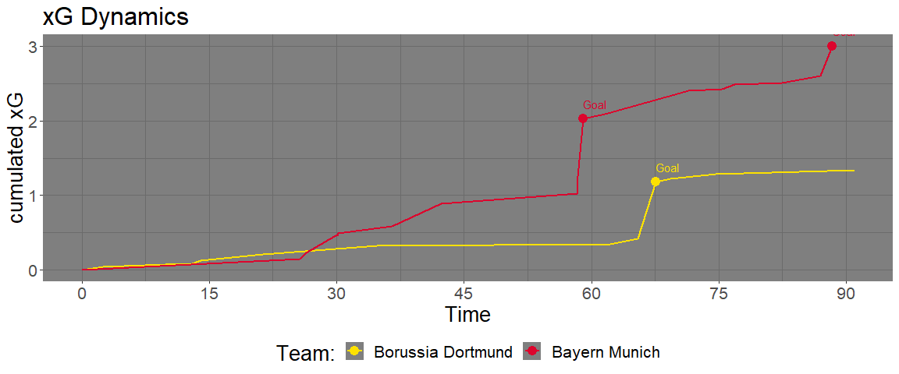
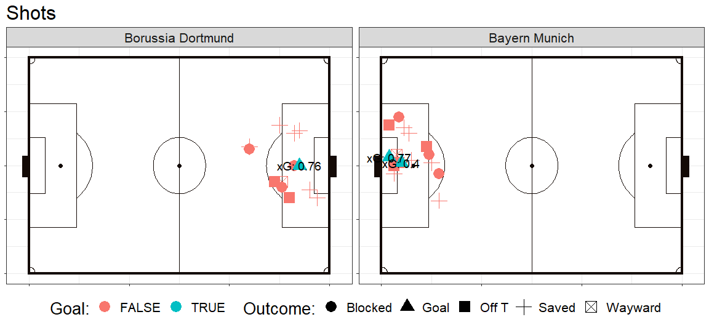
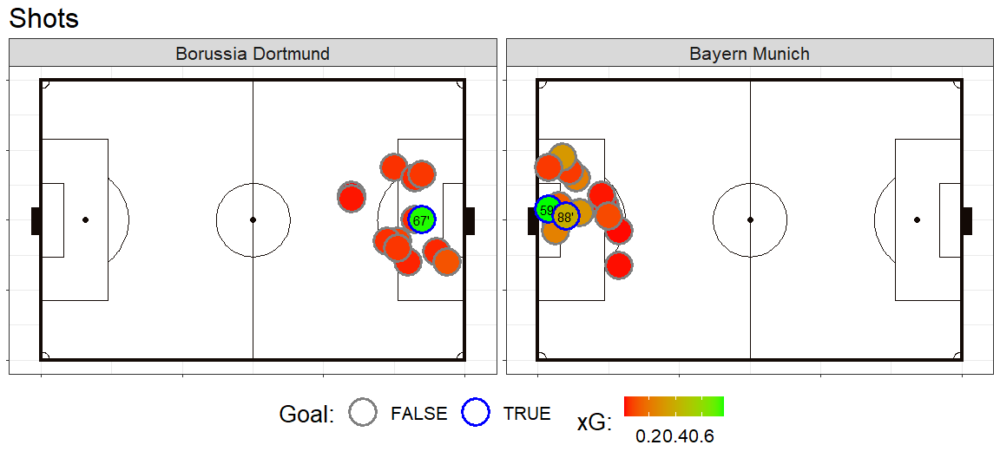
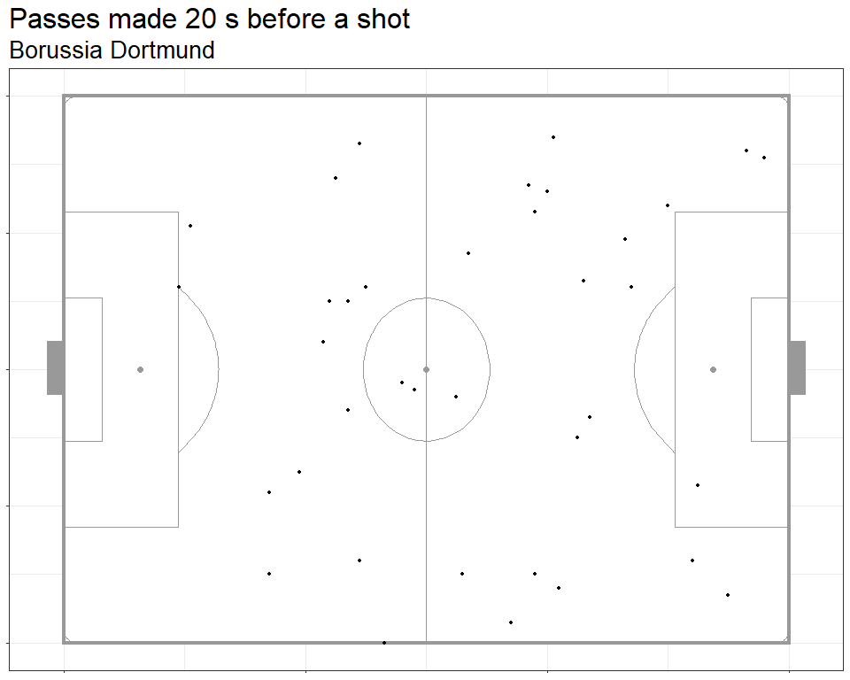

<!-- README.md is generated from README.Rmd. Please edit that file -->

# soccerlytics

<!-- badges: start -->
<!-- badges: end -->

soccerlytics offers several functions that visualise analytical aspects
of football event data.

## Installation

You can install the development version of soccerlytics from
[GitHub](https://github.com/) with:

``` r
# install.packages("devtools")
devtools::install_github("leandrazan/soccerlytics")
```

``` r
library(tidyverse)
library(soccerlytics)
```

### Load data

The visualistions will be carried out based on the publicly availabe
event data set from the 2012/2013 Champion’s League Final. The data is
made available by StatsBomb (<https://github.com/statsbomb/open-data>)
and is provided as example data set in soccerlytics. It can be loaded
with

``` r
data("eventData")
```

### Tactical line up

To plot the tactical line up, we first extract the lineup dataframes
within the event dataset and use the preparation function
`prep_formation_data` which can then be passed to the `plot_formation`
function, along with the additional information of which player was
substituted, here provided in the dataframe `subPlayers`.

``` r
# prepare the dataframes of tactical line ups for both teams and bind the resulting dfs
dfForm <- prep_formation_data(eventData$tactics.lineup[[1]], team.name = "BVB") %>% 
  bind_rows(prep_formation_data(eventData$tactics.lineup[[2]], team.name = "Bayern Munich"))
# get information about players that were substituted
subPlayers <- eventData %>% filter(type.name == "Substitution") %>% 
  select(team.name, player.name, minute, second, starts_with("Sub"))
# visualise the tactical formations
plot_formation(dfFormation = dfForm, colourHome = "#FDE100", colourHome2 = "black",
               colourAway = "#DC052D", hometeam = "BVB", 
               awayteam = "Bayern Munich", subPlayers = subPlayers, 
               formHome = "4-2-3-1", formAway = "4-2-3-1", subicon_just = c(2, -2))
```


## Match dynamics

The function `match_dynamics` can visualise the developement of several
statistics over the duration of the match. You can choose the time
intervals within which the statistic of interest (such as Pass accuracy,
ball possession in %, or pressure events adjusted for opponent ball
possession) is computed, to see how it changes over time. Further,
vertical lines with Shots that were taken and goals that were scored are
shown. Here, one can filter for shots with outcomes that are considered
relevant, e.g. goals and saved shots only. Further, one can choose the
official club colours and set the plot theme such that the background is
either white, light gray or dark gray, depending on what is best for
club colours.

We start with ball possession in %, calculated every 5 minutes.

``` r
match_dynamics(eventData, binsize = 5, type  = "Possession", hometeam = "Borussia Dortmund", 
               colourHome = "#FDE100", colourAway = "#DC052D", theme = "dark")
```


Now we visualise pass accuracy within 5 minute intervals.

``` r
match_dynamics(eventData, binsize = 5, type  = "Pass", hometeam = "Borussia Dortmund", 
               colourHome = "#FDE100", colourAway = "#DC052D", theme = "dark")
```


Compare the latter to pass accurracy within 10 minute intervals, and
plot only shots that were goals.

``` r
match_dynamics(eventData, binsize = 10, type  = "Pass", 
               outcome_names = list(pass = NA, shot = "Goal"), hometeam = "Borussia Dortmund", 
               colourHome = "#FDE100", colourAway = "#DC052D", theme = "dark")
```


We can also visualise cumulated xG values.

``` r
match_dynamics(eventData, binsize = 5, type  = "xg", hometeam = "Borussia Dortmund", 
               colourHome = "#FDE100", colourAway = "#DC052D", theme = "dark")
```



## Attacking zones

As in Bundesliga Match facts, the soccerlytics package can visualise the
attacks per zone. Here, every pass or carry that starts in the first two
thirds of the pitch and ends in the final third is counted as an attack.
The end location of the event determines to which zone the attack is
assigned.

``` r
dfatt <- compute_attacking_zones(eventData)
plot_attack_zones(dfatt, team = "Borussia Dortmund")
```


``` r
plot_attack_zones(dfatt, team = "Bayern Munich", leftToRight = FALSE)
```


## Shots

The function `plot_shotmaps` can visualise goal scoring opportunities.
It takes an event data set as input and returns a list of ggplots, one
plot with information on the outcome of the shot (e.g. Goal, Saved, …)
and one plot with information on the xG value of the shot, and whether
or not a Goal was scored.

``` r
shotmaps <- plot_shotmaps(eventData)
shotmaps$shot_types
```



``` r
shotmaps$shot_xg
```



### Dangerous Passes

Heatmap of dangerous passes, where a pass is considered dangerous when
it was made within a given time window shortly before a shot was taken
(e.g. 15s).

First, one filters the dangerous passes with the function
`get_danger_passes`. The resulting dataframe is then passed to
`plot_danger_passes`. For Borussia Dortmund, the pass locations and the
respective heatmap of dangerous passes look as follows.

``` r
df_dp <- get_danger_passes(df = eventData, shot_window = 20, team = "Borussia Dortmund")
plots <- plot_dangerpass_heatmap(df_dp, shot_window = 20, fill_limits = c(1, 12))
plots$pointplot
```



``` r
plots$heatmap
```


For Bayern Munich, the heatmap looks as follows

``` r
df_dp <- get_danger_passes(df = eventData, shot_window = 20, team = "Bayern Munich")
plot_dangerpass_heatmap(df_dp, shot_window = 20, fill_limits = c(1, 15),
                        leftToRight = FALSE)$heatmap
```


