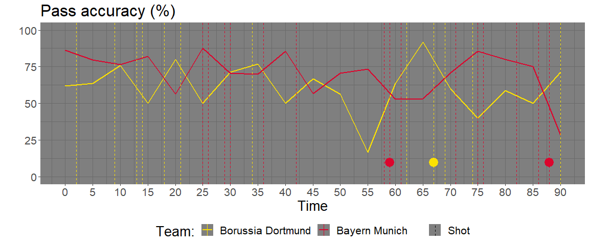

<!-- README.md is generated from README.Rmd. Please edit that file -->

# soccerlytics

<!-- badges: start -->
<!-- badges: end -->

soccerlytics offers several functions that visualise analytical aspects
of football event data.

## Installation

You can install the development version of soccerlytics from
[GitHub](https://github.com/) with:

``` r
# install.packages("devtools")
devtools::install_github("leandrazan/soccerlytics")
```

``` r
library(tidyverse)
library(soccerlytics)
```

### Load data

The visualistions will be carried out based on the publicly availabe
event data set from the 2012/2013 Champion’s League Final. The data is
made available by StatsBomb (<https://github.com/statsbomb/open-data>)
and is provided as example data set in soccerlytics. It can be loaded
with

``` r
data("eventData")
```

### Tactical line up

To plot the tactical line up, we first extract the lineup dataframes
within the event dataset and use the preparation function
`prep_formation_data` which can then be passed to the `plot_formation`
function, along with the additional information of which player was
substituted, here provided in the dataframe `subPlayers`.

``` r
# prepare the dataframes of tactical line ups for both teams and bind the resulting dfs
dfForm <- prep_formation_data(eventData$tactics.lineup[[1]], team.name = "BVB") %>% 
  bind_rows(prep_formation_data(eventData$tactics.lineup[[2]], team.name = "Bayern Munich"))
# get information about players that were substituted
subPlayers <- eventData %>% filter(type.name == "Substitution") %>% 
  select(team.name, player.name, minute, second, starts_with("Sub"))
# visualise the tactical formations
plot_formation(dfFormation = dfForm, colourHome = "yellow", colourHome2 = "black",
               colourAway = "red", hometeam = "BVB", 
               awayteam = "Bayern Munich", subPlayers = subPlayers, 
               formHome = "4-2-3-1", formAway = "4-2-3-1", subicon_just = c(2, -2))
```


## Match dynamics

The function `match_dynamics` can visualise the developement of several
statistics over the duration of the match. You can choose the time
intervals within which the statistic of interest (such as Pass accuracy,
ball possession in %, or pressure events adjusted for opponent ball
possession) is computed, to see how it changes over time. Further,
vertical lines with Shots that were taken and goals that were scored are
shown. Here, one can filter for shots with outcomes that are considered
relevant, e.g. goals and saved shots only.

We start with ball possession in %, calculated every 5 minutes.

``` r
match_dynamics(eventData, binsize = 5, type  = "Possession")
```

 Now
we visualise pass accuracy within 5 minute intervals.

``` r
match_dynamics(eventData, binsize = 5, type  = "Pass")
```



Compare the latter to pass accurracy within 10 minute intervals, and
plot only shots that were goals.

``` r
match_dynamics(eventData, binsize = 10, type  = "Pass", outcome_names = list(pass = NA, shot = "Goal"))
```


We can also visualise cumulated xG values.

``` r
match_dynamics(eventData, binsize = 5, type  = "xg")
```


